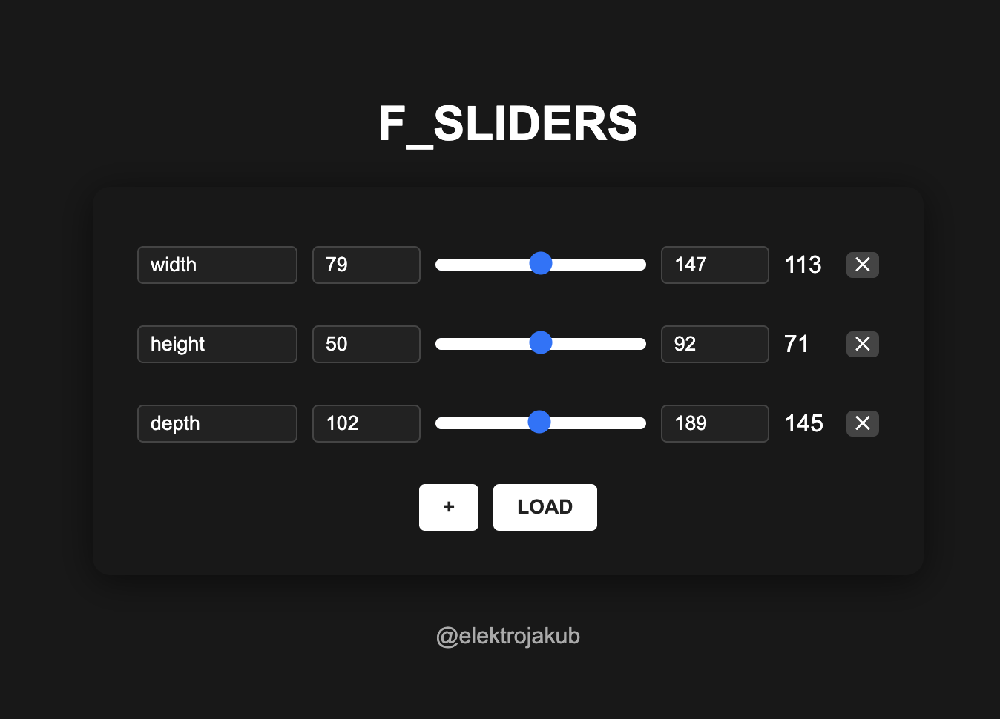

# F360_SLIDERS

A real-time parameter control system for Autodesk Fusion 360 with a web-based slider interface.



## Overview

F360_SLIDERS allows you to control Fusion 360 parameters in real-time using an intuitive web interface with sliders. It consists of:

1. A Node.js web server that hosts the slider interface
2. A Python script that runs in Fusion 360 and syncs parameters
3. A communication system between the two using JSON files

## Installation

### Prerequisites

- [Node.js](https://nodejs.org/) (v12 or later)
- [Autodesk Fusion 360](https://www.autodesk.com/products/fusion-360/) with API access

### Setup

1. **Clone or download this repository:**
   ```
   git clone https://github.com/jski7/F360_SLIDERS.git
   cd F360_SLIDERS
   ```

2. **Install Node.js dependencies:**
   ```
   npm install
   ```

## Running the Application

### Step 1: Start the Web Server

1. In the project directory, start the Node.js server:
   ```
   npm start
   ```
   
2. The server will start on port 3000. You should see:
   ```
   Server running at http://localhost:3000
   ```

### Step 2: Run the Fusion 360 Python Script

1. **Option A: Run directly from this folder:**
   - Open Fusion 360
   - Go to **Tools** > **Scripts and Add-Ins**
   - Click the green "+" icon next to "My Scripts"
   - Navigate to the `sliders_python` folder in this project
   - Select the folder and click "Open"
   - Find "SLIDERS_PYTHON" in the scripts list and click "Run"

2. **Option B: Copy to Fusion 360 scripts folder:**
   - Copy the entire `sliders_python` folder to your Fusion 360 scripts folder:
     - **Windows:** `C:\Users\<username>\AppData\Roaming\Autodesk\Autodesk Fusion 360\API\Scripts`
     - **macOS:** `/Users/<username>/Library/Application Support/Autodesk/Autodesk Fusion 360/API/Scripts`
   - Open Fusion 360
   - Go to **Tools** > **Scripts and Add-Ins**
   - Find "SLIDERS_PYTHON" in the scripts list and click "Run"

3. A small palette window will appear in Fusion 360 with a "Stop" button
   - **Keep this window open** while you want parameters to sync
   - Click "Stop" or close the window when you're done

### Step 3: Use the Web Interface

1. Open your browser and go to: http://localhost:3000

2. You will see the F_SLIDERS interface with:
   - Initially empty or with your current parameters
   - White sliders with colored square handles
   - "+" and "LOAD" buttons at the bottom

## How to Use

### Basic Controls

- **Sliders:** Drag to change parameter values in Fusion 360 in real-time
- **Parameter Name:** Edit the text field to rename parameters
- **Min/Max:** Set slider range using the number fields
- **✕ Button:** Delete a parameter
- **+ Button:** Add a new parameter
- **LOAD Button:** Import all current Fusion 360 parameters

### Workflow Example

1. Open your Fusion 360 design
2. Run the SLIDERS_PYTHON script
3. In the web interface, click "LOAD" to import current parameters
4. Adjust sliders to modify your design in real-time
5. Add new parameters or modify ranges as needed
6. When finished, click "Stop" in the Fusion 360 palette

### Important Notes

- Parameters are saved in `sliders_python/parameters.json`
- Fusion 360 parameters are exported to `sliders_python/config.json` when the script starts
- Updates happen 10 times per second (adjustable in the Python script)
- When loading parameters, sliders are automatically set with ranges from 70% to 130% of the current value

## Troubleshooting

- **Server won't start:** Check if port 3000 is already in use
- **Parameters not updating:** Ensure the palette window is still open in Fusion 360
- **Script errors:** Check Fusion 360's Text Commands panel for error messages

## Credits

Created by [@elektrojakub](https://www.instagram.com/elektrojakub/)

## License

MIT
